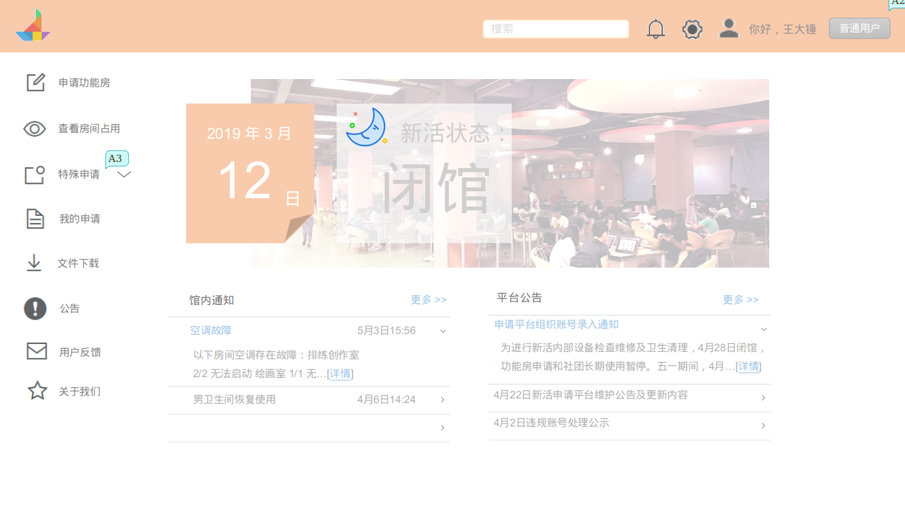

个人作业2
=========

#### 选题：

使用业务、组织、技术三维模型系统管理方法分析某校园项目（可自定义）的可行性。

一、分析题目
------------

分析开发至善园新生活动中心管理系统的可行性

二、项目背景
------------

至善园新生活动中心是一个由大厅、录音室、舞蹈室、钢琴室、音乐练习室、仓库、讨论室、音乐沙龙、乐队练习室等功能房组成，拥有音响、话筒等设备，可供我校师生免费预约使用房间、借用设备的场所。为了保证使用功能房和设备的都是我校师生，保证我校师生使用有序不冲突，得到优良的使用体验，调研认为有必要开发一个活动中心管理系统。

以下是新生活动中心管理系统的部分效果图：

三、使用业务、组织、技术三维模型系统管理方法分析可行性
------------------------------------------------------

#### 业务

成本上只需要组织一群同学进行设计、开发工作，开发完成即可投入使用，之后只需要投入少量人力进行简单的运维，即可保证系统的长期正常使用。

使用电脑系统进行管理相较于用传统的人力纸笔登记调度而言，能减少活动中心助理的大部分工作量，即成本低、收益高。

#### 组织

组织结构上使用项目集组织结构。总体由即将毕业、具有丰富开发经验的大四师兄们充当“行业专家”的角色，在系统ui审美和技术层面进行指导；项目经理部中分为技术组、运维组、数据组、总体组。技术组负责技术选型（JAVA还是Go？angular还是react等）和开发工作；运维组由技术组成员身兼，负责后期系统的维护与更新；数据组负责搜集开发相关所需资源；总体组负责把控项目进度和设计调性。并有变革管理组和质量控制组负责监督项目大小部件质量。

该项目能得到负责管理新生活动中心的老师的支持。整个项目规划用一到两学期完成整个开发工作，并在第二学期开始投入使用。

#### 技术

新生活动中心地处东校园，能组织起足够的计算机相关专业助理同学作为产品组成员助理进行本次开发，并有其余秘书组、宣传组等同学能担任沟通、协作、提建议和监督工作。活动中心能提供开发协作的场地和良好的网络环境，过去多年新生活动中心的数据和系统也均存在移动硬盘，并能够完成数据迁移。

综上所述，开发至善园新生活动中心管理系统是可行的。

