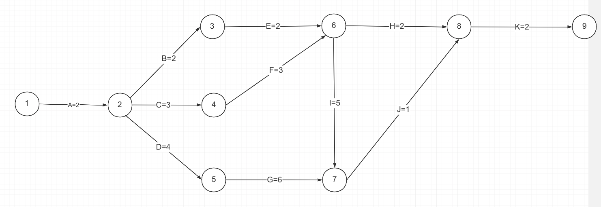
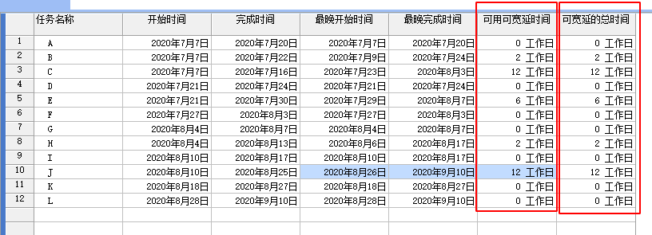
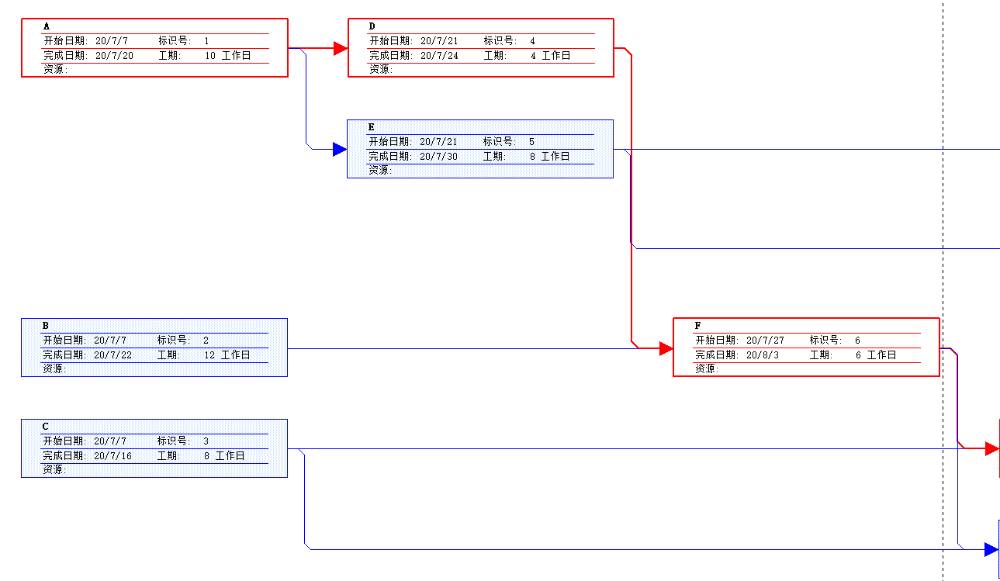
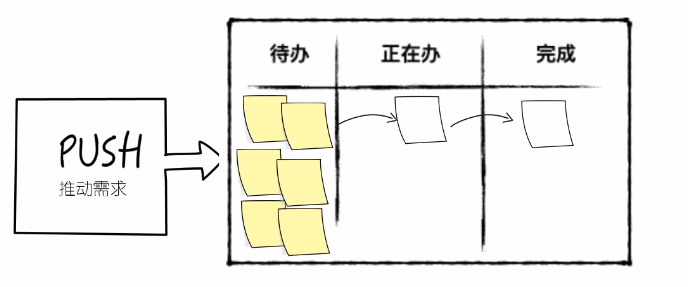
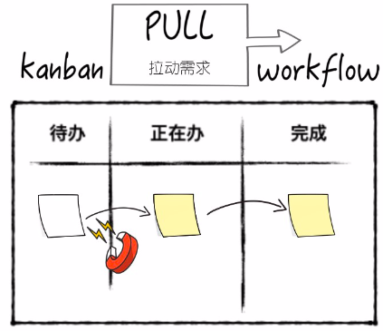
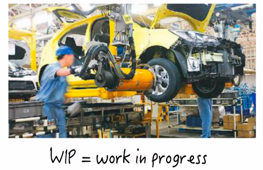
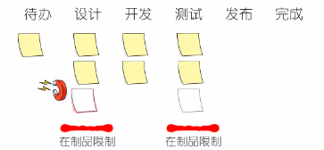
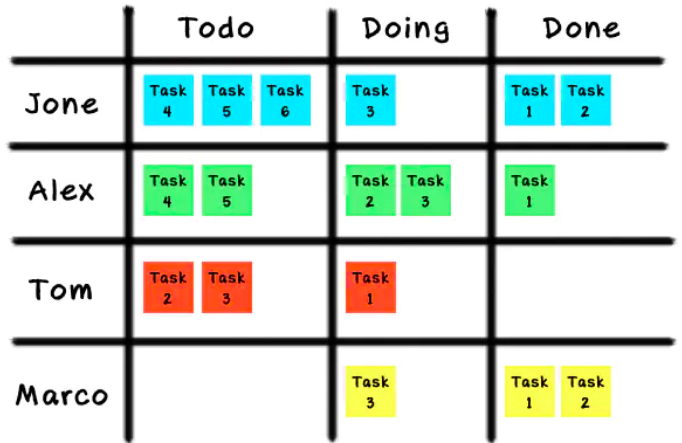
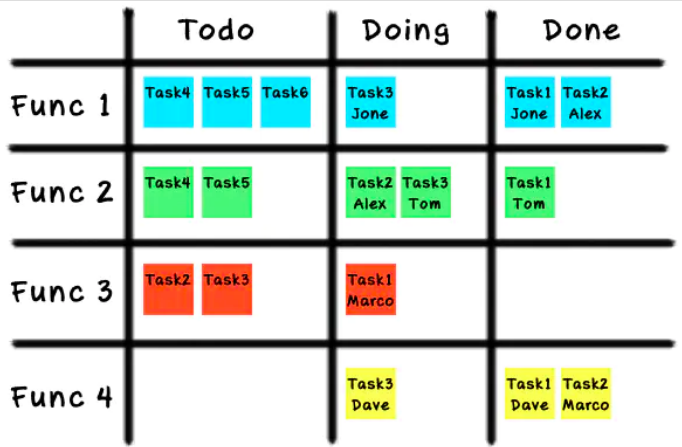

个人作业6
=========

一、教材习题6
-------------

#### a.双代号网络图



#### b.找出所有路径并标出长度

- 路径1：A-B-E-H-K	长度 = 2+2+2+2+2 = 10天
- 路径2：A-B-E-I-J-K  长度 = 2+2+2+5+1+2 = 14天
- 路径3：A-C-F-H-K 长度 = 2+3+3+2+2 = 12天
- 路径4：A-C-F-I-J-K 长度 = 2+3+3+5+1+2 = 16天
- 路径5：A-D-G-J-K 长度 = 2+4+6+1+2 = 15天

#### c.关键路径与长度

因为关键路径指项目起点和终点之间的最长路径，所以：

关键路径：A-C-F-I-J-K 

长度：16天

#### d.完成该项目所需的最短时间

因为关键路径的工期是项目最早完成的工期，所以是16天。

二、教材习题7
-------------

首先根据练习4，在纸上画双代号网络图，然后确定每个活动的前置任务：

| 活动 | 前置活动 |
| :--: | :------: |
|  A   |    -     |
|  B   |    -     |
|  C   |    -     |
|  D   |    A     |
|  E   |    A     |
|  F   |   B、D   |
|  G   |   C、F   |
|  H   |   C、F   |
|  I   |   E、G   |
|  J   |   E、G   |
|  K   |   H、I   |
|  L   |    K     |

#### 关键路径


如图，红色的是关键路径：A-D-F-G-I-K-L

#### 每项活动的浮动时间或时差



在project中，总时差称为“可宽延总时间”，自由时差称为“可用可宽延时间”

#### 介绍


<center>任务进度表</center>

在练习4中，根据项目的网络图数据，在project 2007中填充生成了这张任务进度表，最左侧的编号是任务的编号，任务名称、工期、开始时间供自定义，project 2007会自动根据工期长度补充完成时间，前置任务里的数字是最左列的编号，使用编号是为了保证表格的简洁性、可读性，避免任务名称太长、太繁杂，让读者一目了然。


<center>甘特图</center>

有些人认为甘特图就是任务进度表，事实上甘特图确实也能承担这个作用。在project 2007中，随着使用者填写完任务进度表，会自动生成甘特图，**使任务进度可视化**。甘特图按时间顺序展示了每项任务以及任务的开始日期、结束日期，凭借条形长度直观地展现任务的工期长短，并用箭头指向下一个任务。途中**红色的部分表示关键路径**。随着任务进度的推进，条形块会相应地改变颜色，比如如果第一个任务完成了50%，则条形块前一半变成黑色。因为图中任务的进度暂且都是0%，所以颜色暂时都是红色和蓝色。任务进度表和甘特图常常共同展示。




<center>网络图：project里的网络图太太太长了，而且没有办法在保持清晰的前提下整个导出，只能分割显示。</center>

维基百科表示，网络图(Network planning)是一种图解模型，形状如同网络，故称为网络图。 网络图是由作业（箭线）、事件（又称节点）和路线三个因素组成的。 在工程管理中，经常使用到网络图的概念。 网络图是用箭线和节点将某项工作的流程表示出来的图形。

途中每一个节点表示一个任务，箭头从前一个任务指向后一个任务，红色部分反映关键路径，关键路径指项目起点和终点之间的最长路径，也是项目最早完成的工期。

三、收集网上资料，总结看板在软件项目中的使用
--------------------------------------------

要求：2-3页

### 1 看板的理念

**看板管理**，常作“Kanban管理”（来自日语“看板／カンバン *Kanban*”），是[丰田生产模式](https://zh.wikipedia.org/wiki/丰田生产模式)中的重要概念，指为了达到[及时生产](https://zh.wikipedia.org/wiki/及时生产)（JIT）方式控制现场生产流程的工具。及时生产方式中的[拉式](https://zh.wikipedia.org/w/index.php?title=推拉策略&action=edit&redlink=1)生产系统可以使信息的流程缩短，并配合定量、固定装货容器等方式，而使生产过程中的[物料](https://zh.wikipedia.org/wiki/物料)流动顺畅。

在**华为云**的介绍中：

```
1.看板协作是一种业界流行的轻量、灵活和简单的团队协作方法，它将项目的需求、缺陷和任务可视。让每个人一目了然地掌握每项工作的状态，团队通过拉动工作卡片更新工作进展，及时暴露风险和问题。
2.看板协作是业界流行的轻量、灵活和简单的团队协作方法，没有工作项的Epic/Feature/Story层级划分，直接将需求、缺陷和任务可视化。
3.看板协作适合任何行业、任何团队、任何角色高效协作。
```

### 2 如何使用(启动)看板

在说到使用（启动）看板之前，我们首先来看这样一个场景：

在敏捷项目中，可能会遇到这样的情况：**甲方爸爸又双叒改需求了！**

这时候**scrum项目经理会说**，我们理解您的需求，但是我们已经开始一个迭代了，这个迭代周期是x周时间，在这个时间，我们不能更改迭代的目标，这是scrum的原则。在这个迭代之后，我们会开启下一个迭代，把您的需求考虑进来。

**而kanban经理会说**，好嘞，我们会把任务分解好，只要我们团队谁的任务处理完了，马上处理您的需求！您可以随时在我们共享的看板上，查看我们的任务进行得怎么样了。如果您需要修改优先级或需求内容，随时联系我更改待办内容即可。

—— 听起来看板的使用极其灵活。

那么我们来看一下，当需求来临时，**看板处理需求的两种逻辑：Push vs. Pull.**

#### **2.1 Push**



Push方法希望每个人的工作尽可能饱和，Scrum就是这种逻辑，在这点上Scrum与传统项目管理并无区别，即待办push给执行，执行完push给验收。

#### **2.2 Pull**



Pull方法追求的是workflow的通畅，当某个环节应有的任务量小于预期，就去上一个环节pull任务，工作任务只有被右端拉动时才进入到进程。为什么要这样做呢？这又涉及到了WIP(Work in Progress，在制品)的概念。

#### **2.3 WIP(Work in Progress)**



在制品概念来源于制造业，在产品被制作成成品之前，都叫做“在制品”，“在制品”占用了资源却并未形成价值，在制造业中，“在制品”占用了库存和成本；在软件项目中，“在制品”是代码，占用了开发和维护资源。

控制在制品，目的在于控制资源的浪费。过多的在制品，会阻塞流程，浪费资源；过少的在制品又反映了供应不足，产能闲置。

因此，在pull方法中，只有右侧拉动才增加在制品，灵活控制在制品的数量。

除了WIP，还需要了解slack time，即自由时间，在一个任务完成之后、下一个任务开始之前用于完善、总结等工作，总之，对workflow有益即可。

#### 2.4 看板在软件项目中的使用(启动)步骤

了解了上述概念之后，我们来看kanban在软件项目中的使用(启动)步骤：



1. 整理流程，将任务划分到待办、设计、开发、测试、发布、完成环节中；
2. 可视化任务，例如用便签纸，到这一步实现将任务可视化管理；
3. 设置在制品限制，譬如限制设计和测试中的在制品数量为3； 
4. 扩展流程，设置“ready for xx”环节，作用类似河流中的蓄水池，便利软件项目管理。

至此，我们明白了看板的执行理念和启动原理。

### 3 看板与分类

#### 3.1 看板在项目流程中载体的分类

**3.1.1 实体白板/黑板**

这是敏捷开发团队中用的最多，最直接的一种看板类型，且适合团队所有成员都在一个办公室工作的环境。它的优点一目了然，方便工作成员展示自己的任务和进度，另一方面则可以提高成员间互相竞争的意识（谁干的多，谁解决的问题越难，成就感就越强）。当然，缺点也很明显，就是没有历史记录。虽然可以使用不定期的拍照来解决，但是还是不方便追溯。

白板适用在项目管理中所包含的元素有：

- 白板
- 列表(纵向列表、横向泳道)
- 便签纸
- 图钉、磁铁

**3.1.2 互联网式的看板**

既然有实体工具，当然也有软件化的工具。国内外的项目管理工具非常多，但是能实现敏捷开发的工具却不多，而能像看板一样展示的工具更不多。常见的看板工具：

- **Trello**：有网页端也有移动端，网址是 [https://trello.com/](https://link.jianshu.com?t=https://trello.com/)
- **WeKan**：参考Trello实现的开源版。与Trello最大的区别在于每个任务没有Deadline，且没有移动端。网址 [https://wekan.io/](https://link.jianshu.com?t=https://wekan.io/)
- **leangoo**：国人开发，网址 [https://www.leangoo.com/](https://link.jianshu.com?t=https://www.leangoo.com/) 

在软件类的项目管理工具中，最大的优点就是有历史记录的追溯，方便查询快照，而且**对于一个成员在异地工作的团体来说，互联网式的看板工具是一种最好的选择**。

#### 3.2 项目管理在看板中的职责分类

**3.2.1 项目管理主导型**

项目管理是整个团队的大总管，他非常清楚团队中各个成员的优缺点，所以他能够知道什么任务派给谁是最适合的。

下图最能体现出大总管的主导作用，项目管理把任务分配给`Jone`、`Alex`、`Tom`或者`Marco`，成员只要完成自己的任务就好。



**3.2.2 成员主导型**

这里看到成员主导型，也许有人就觉得项目管理就没事了。错！项目管理依然要把项目拆分成各个小任务，然后，然后就让大家自己去“抢”任务了。

“抢”任务，为什么要抢？前提是成员自己认为能够胜任这个任务，二是要建立在多劳多得或者是绩效考核之上的，如果没有这些，就没有“抢”的意义了。

以下是成员主导型的看板展示：



**3.2.3 根据团队的规模增减看板**

- 如果你是一个后端的**开发主管**，那你的手下肯定都是后端，则列表项就是最基本的**Todo**、**Doing**、**Done**三列

- 如果你是一个**技术部的老大**，你管理者程序员、测试、运维，那你的列表项可以是**Todo**、**Dev-Doing**、**Dev-Done**、**Testing**、**Deploy**五列

- 如果你是一个**产品制作人/产品经理**，你的团队成员包含了一个产品创建所需要的所有人员，那你可能需要2个看板，一个是需求池看板，一个是迭代流程的看板。

四、参考资料
------------

1.https://www.jianshu.com/p/24e8229adc62

2.https://www.bilibili.com/video/BV1vA411i7mV?from=search&seid=6009909650971496496