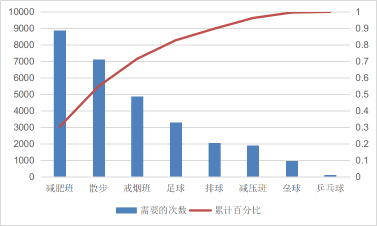

个人作业8
=========

选择教材操作案例（running case）

作业1
-----

（1）两个星期内，90%的员工都能登录到系统；

（2）1个月内，95%的员工把健康状况相关指标输入系统，并得到系统的健康建议 

（3）2个月后，员工在关于系统方便、详实、使用愉快及快速上满意度超过90%

（4）8个月后，员工的健康状况数据较初始有所改善，降低了医疗保健的费用

作业2
-----

| 质量标准或需求标号 |                         衡量满足过程                         |
| :----------------: | :----------------------------------------------------------: |
|       （1）        | 把员工登录系统作为培训计划的一部分，跟踪谁参加了培训，在系统中建立一个特征，通过用户姓名、部门等跟踪用户量。 |
|       （2）        | 在上述提到的特征中纳入对员工输入健康指标情况、医疗保健费用情况的采集。 |
|       （3）        | 两个月后，给系统使用员工发放关于使用系统是否方便、健康资讯是否详实、整体交互是否愉快、快速的问卷调查。 |
|       （4）        | 通过定期收集员工健康状况数据反馈，医疗保健费用反馈，进行动态分析，了解员工健康状况是否有所改善，是否达到降低医疗保健费用的目的。 |

作业3
-----

