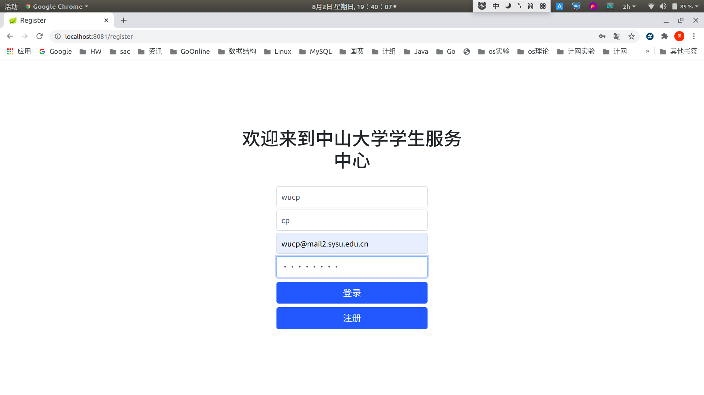
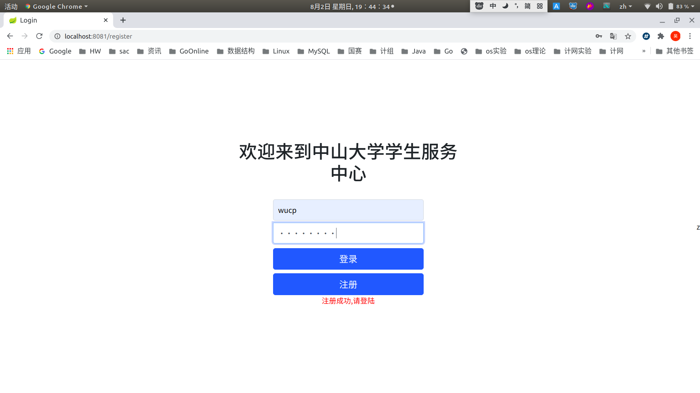
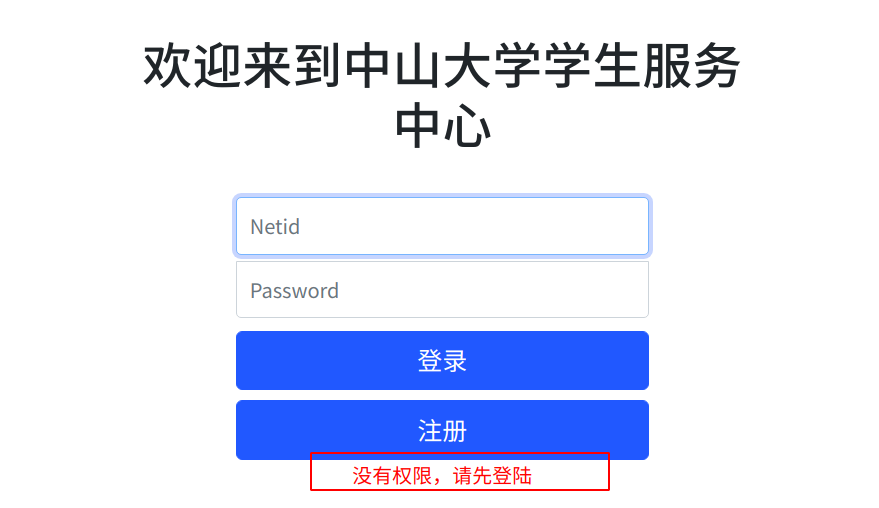
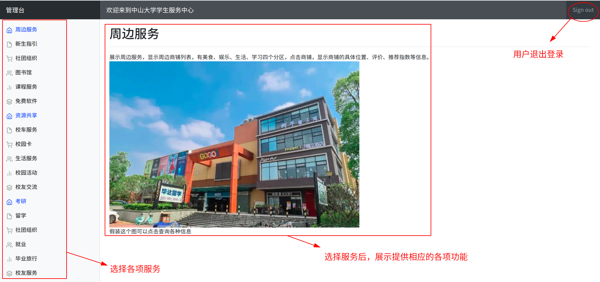

大作业 - 技术报告
=================

1 项目内容
----------

#### 1.1 项目背景

为便利师生学习和生活，中山大学为学生提供了许多信息技术产品和服务，包括应用软件、Web端产品、小程序和公众号等。从领取录取通知书到成为校友，学生可以直接通过这些产品办理各项业务。

- 项目目标：实现一个提供在线项目管理服务的软件，通过web端或其他平台提供服务。
- 发布产品：项目管理软件app、项目管理软件web端、项目管理软件pc端。
- 主要工作活动：需求分析、产品设计、产品发布、产品维护。
- 主要工作制品：需求分析文档、软件设计文档、软件使用手册、商业计划书、软件源代码
- 关键里程碑：
	- 6.25之前收集资料，完成需求分析；
	- 7.10之前完成项目设计文档；
	- 7.25之前开发pc端原型，搭建基本框架
	- 8.05之前完成内部测试，完善服务；
	- 8.25之前完成web端，app开发；
	- 9.10之前完成内部测试；
	- 9月进行开发测试，收集反馈；
	- 9.31正式交付。
- 所需资源：开发团队补助、服务器租金

#### 1.2 产品需交付的文档

软件项目管理计划、需求规格说明初稿、设计报告初稿、测试文档、用户手册、个人项目总结、其他文档（如周报、开发日志、测试日志等）。

2 本人承担的角色
----------------

- 文档编写：合作完成项目管理计划

- 项目开发：完成大作业项目的开发。搭建整个项目的MVC框架，实现登录、注册、登录拦截、避免表单重复提交、主页面展示等具体功能以便于测试人员进行工作。

3 开发环境
----------

Ubuntu 18.04

IDEA 2020

4 技术选型
----------

前端框架：Bootstrap

模板引擎：Thymeleaf

后端：Springboot+Gradle

数据库：MySQL

考虑到我们项目开发要求的成品，是一个能实现需求文档的web产品，web端不仅要能展现多种功能相关的页面，还需要和用户（师生）进行多种类型的交互。因此，为了能快速开发出前端风格简洁的产品，便利地实现前后端的交互，问选择使用Bootstrap和Thymeleaf。软件架构选用MVC模式，为了快速开发，后端选用Springboot和Gradle；而数据库方面使用MySQL。

5 产品展示
----------

#### 5.1 实现功能

- 注册
- 登录：登陆后通过session的方式让后端识别操作者身份
- 学生管理台
	- 此页仅示意17个功能。
- 登录拦截器：以防用户即使不登录也能通过url的方式访问到管理台界面
- 解决了刷新时表单重复提交的问题
- 退出登录

#### 5.2 具体效果

注册：

登录：

当用户没有登录却试图通过输入url直接进入管理台时，进行拦截：

进行各种交互的主页面，左侧选择各项服务，右上角退出登录，余下整体页面进行各种UI交互：

6 个人总结
----------

在整个团队作业的合作中，前期我负责和组员共同编写项目管理计划，过程中通过交流、思考、查阅资料理清整个项目推进的流程，把课堂上教授的内容融入到作业中去。

后期我负责项目的开发，首先分析我们项目的迭代过程应该是如何的，然后敲定基于xx的因素选择yy方法，然后进行实际开发。经过一番考虑，我认为，对我们这门课程来说，多开发软件功能对课程本身没有意义，重点其实是围绕软件迭代任务，尽可能地使用软件管理办法和工具。（此处略去xx字开发感想，你觉得300字就300字，800字就800字）。

所以在我们小组的最终成品中，我们交出的软件不能完整实现项目的所有需求，但是却“可以实现项目的所有需求”——因为不能实现的地方不是做不到，而是没有写。在这个项目的基础上，只要补充各个功能对应的Controller文件和html文件（事实上，html文件也只用编写它们独有的部分，主页面编写时就考虑到了复用的需要）就可以实现对应的功能。也就是说，完全可以依照现有的思路继续写下去完成整个项目。而项目中已实现的功能则是为了展现我们这个项目成品的模样，并便于测试人员进行工作——测试自然也是项目迭代的一部分。

经过这一学期的课程，我了解、掌握了许多新的知识，并进行了一些实践。感谢老师和ta师兄师姐们的付出~