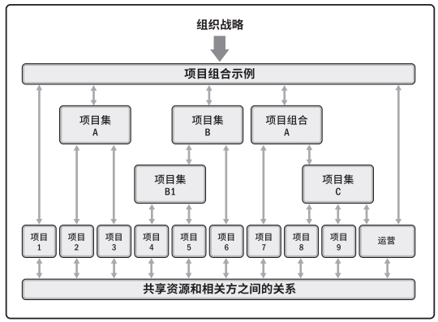
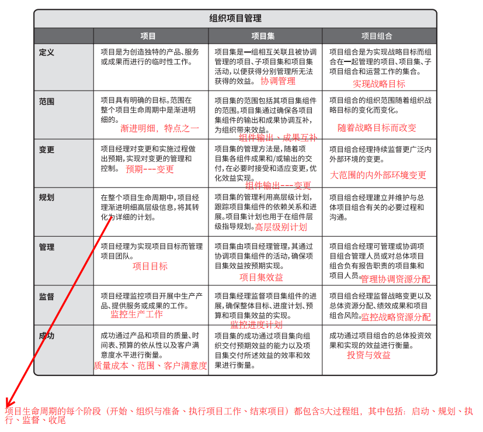
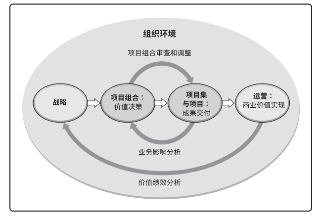

个人作业1
=========

#### 要求：

讨论projects、programs和portfolie之间的关系以及对企业成功的贡献；以及与operations以及OPM之间的关系。

- 请先阅读《PMBok6》中文版，第一部分的1.2.3节；第二部分1.2节；
- 必须描述projects、programs、portfolio、operation和OPM的概念；
- 必须用图或表格表达它们之间的关系与区别，使得读者更容易理解；
- 必须列举合适案例用以区别这些概念

一、概念描述
------------

#### Project

项目。项目视为创造独特的产品、服务和成果而进行的临时性的工作。包括但不限于：为市场开发新的复方药、拓展导游业务、合并两家组织等。

#### Program

项目集。项目及是一组相互关联且被协调管理的项目、子项目和项目集活动，以便获得分别管理所无法获得的利益。项目集不是大项目。规模特别大的项目称为“大型项目”。一般定义，大型项目通常需要10亿美元或以上的成本，可以影响上百万人，并且持续数年。

#### Portfolio

项目组合。项目组合是指为实现战略目标而组合在一起管理的项目、项目集、子项目组合和运营工作。

#### Operation

运营管理。运营管理关注产品的持续生产和（或）服务的持续运作。它使用最优资源满足客户要求，来保证业务运作的持续高效。它重点管理那些把各种输入（如材料、零件、能源和劳力）转变为输出（如产品、商品和（或）服务）的过程。

#### OPM

组织级项目管理。OPM 指为实现战略目标而整合项目组合、项目集和项目管理与组织驱动因素的框架。OPM 旨在确保组织开展正确的项目并合适地分配关键资源。OPM 有助于确保组织的各个层级都了解组织的战略愿景、支持愿景的举措、目标以及可交付成果。

二、关系与区别
--------------

#### 项目组合、项目集、项目

##### 三者图解

从组织的角度来看项目、项目集和项目组合管理：

- 项目集和项目管理的重点在于以“正确”的方式开展项目集和项目；
- 项目组合管理则注重于开展“正确”的项目集和项目。

##### 三者的比较描述

#### Operations以及OPM之间的关系

#### 以案例区分

可以把《鬼吹灯》系列的影视开发看做一个portfolio，那么项目组合中包含了众多的项目集（program），即精绝鬼城项目集、龙岭迷窟项目集、云南虫谷项目集、昆仑神宫项目集、黄皮子坟项目集、南海归墟项目集、怒晴湘西项目集、巫峡棺山项目集共八个项目集。而每个项目集中又有众多的project，比如影视布景建设、特效团队设计、主演阵容组建、剧本策划管理 、团队账目处理等。