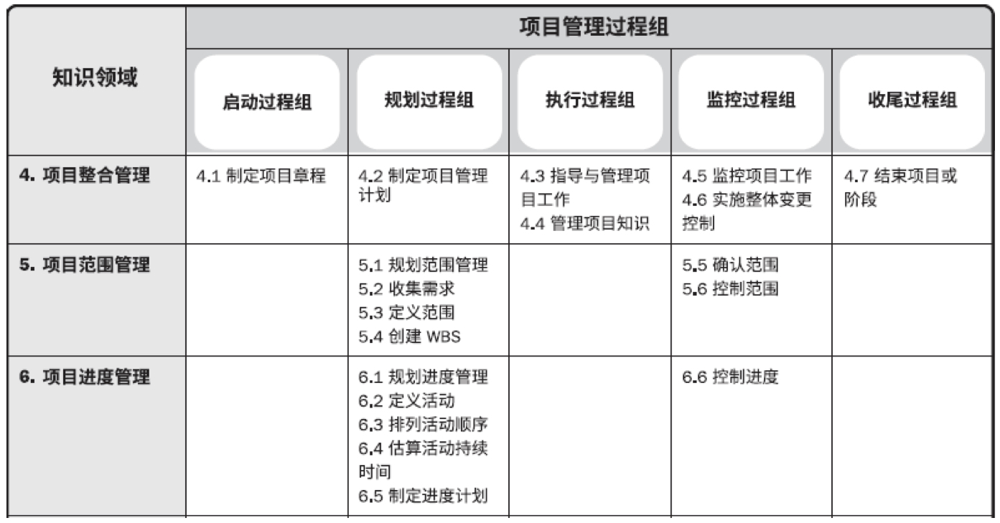
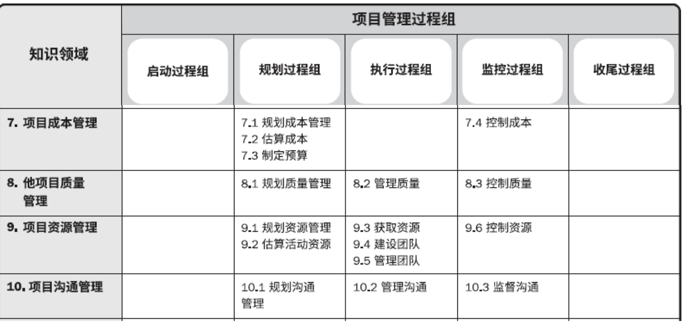
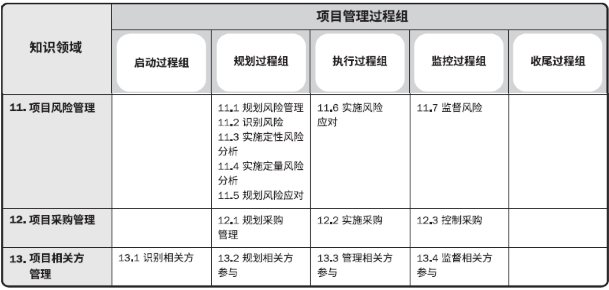

个人作业3
=========

**1 了解CMMI项目管理过程 - 项目计划（PP），使用知识域*过程矩阵对比项目规划过程组与CMMI - PP过程**

参考课件：

可知：

|                |                        项目规划过程组                        |                        SG1                         |                             SG2                              |                       SG3                        |
| :------------: | :----------------------------------------------------------: | :------------------------------------------------: | :----------------------------------------------------------: | :----------------------------------------------: |
|  项目整合管理  |                       制定项目管理计划                       | 建立估计计划： 建立和维护项目计划参数的估计数据 | 开发项目计划： 要建立和维护项目计划，并作为管理项目的基础 | 获得对计划的承诺： 建立和维护对项目计划的承诺 |
|  项目范围管理  |      规划项目管理 收集需求 定义范围 创建WBS      |        估计项目的范围 建立项目属性的估计        |                                                              |                                                  |
|  项目进度管理  | 规划进度管理 定义活动 排列活动顺序 估算活动持续时间 制定进度计划 |                  定义项目生命周期                  |                           建立进度                           |                                                  |
|  项目成本管理  |             规划成本管理 估算成本 制定预算             |               确定工作量和成本的估计               |                           建立预算                           |                                                  |
|  项目质量管理  |                         规划质量管理                         |                                                    |                                                              |                                                  |
|  项目资源管理  |                 规划资源管理 估算活动资源                 |                                                    |               计划数据的管理 计划项目的资源               |                  协调工作和资源                  |
|  项目沟通管理  |                         规划沟通管理                         |                                                    |                     计划所需的知识和技能                     |                                                  |
|  项目风险管理  | 规划风险管理 识别风险 实施定性风险分析 实时定量风险分析 规划风险应对 |                                                    |                         识别项目风险                         |                                                  |
|  项目采购管理  |                         规划采购管理                         |                                                    |                                                              |                                                  |
| 项目相关方管理 |                        规划相关方参与                        |                                                    |                    计划项目相关人员的参与                    |                                                  |
|    其他知识    |                                                              |                                                    |                         建立项目计划                         |       评审项目的附属计划 获得计划的承诺       |

**联系与区别**

基本上，项目管理过程组与行业过程都是把整个项目划分为多个module，能足够覆盖十大知识领域的同时也便于管理。区别在于，项目管理过程组在子模块内容相对独立的同时又能层层递进，时间上有明显的推进；而行业过程的独立性不明显，联系性强，不同模块之间完全可以相互交叉。

2 阅读JWD案例的前期准备任务，结合创新项目实践，构建软件项目创新竞赛项目准备过程（组），该过程（组）目标交付物为Business Case。

项目准备过程：

- 决定项目范围、时间、成本约束；
- 识别项目发起人
- 开发项目业务场景（business cases）
- 开会讨论项目管理过程
- 确定项目是否分为多个子项目
- 了解业务场景，提供技术方案。给出大致的时间与开发成本。
- 提供更遍历的方案，比如用微信小程序让客户直接访问系统。

综上，即为软件项目创新竞赛项目准备过程（组）的内容。

**参考内容：**

http://www.uml.org.cn/cmm/200902041.asp