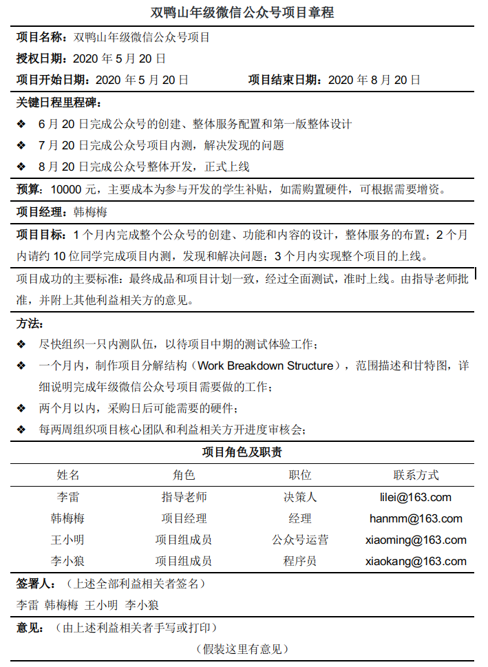
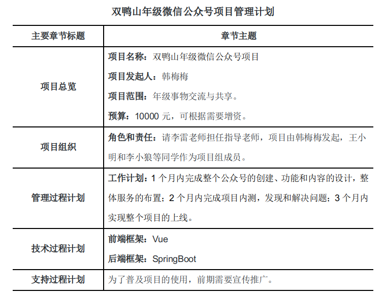
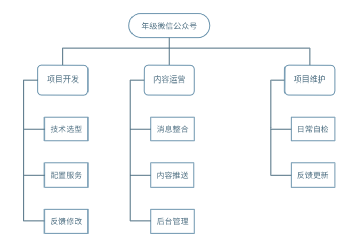
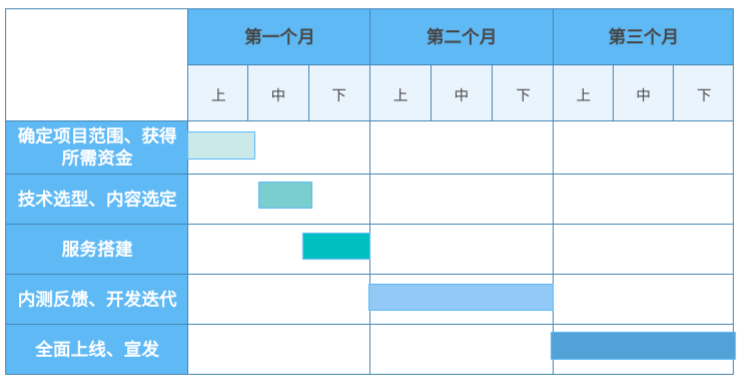
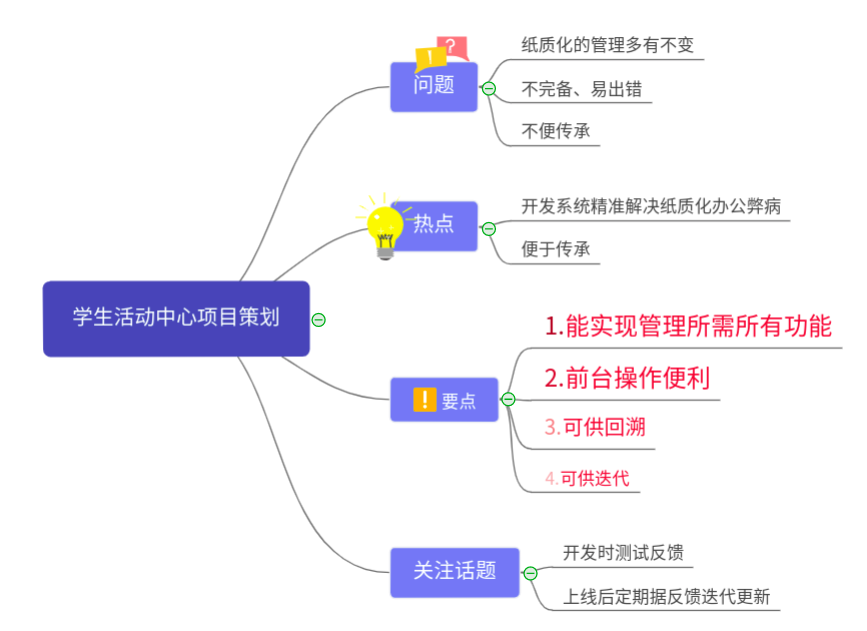

个人作业4
=========

#### 选题

选题1和题3

选题1
-----

**题目**

你联合同学做一个年级微信公众号加强各班相互了解、联合活动等。请编制**项目章程**和**项目管理计划**，指导该项目实施与运营。必须包含WBS和甘特图。

#### 1 项目章程

#### 2 项目管理计划

#### 3 WBS(Work Breakdown Structure)

首先总结一下WBS的关键概念：

- WBS以**可交付成果**为对象，而不是以计划活动为对象
- WBS常见的分解方式包括：按照产品的物理结构、产品或项目的功能用途、项目的实施阶段和过程、项目组织的地域分布、各个子目标、部门或者职能角色等等
- **分解的粒度要遵循“可以分配、可以交付”**
- WBS的另一作用，是**实现项目进度和成本控制的基础**

那么，我的答案：

#### 4 甘特图

选题3
-----

#### 题目

召开一个**项目策划研讨会**，每个人用思维导图记录会议内容，该图必须满足“**话题跟踪、热点标注、要点排序、问题汇总**”四个基本要求。最后，给出这样会议记录的优点与缺点。

#### 项目选题

学生活动中心管理系统开发项目 

#### 项目背景

纸质化管理学生活动中心多有不便，且不完善，需开发一个管理系统以便工作，故召开一个项目策划研讨会。

#### 思维导图

#### 