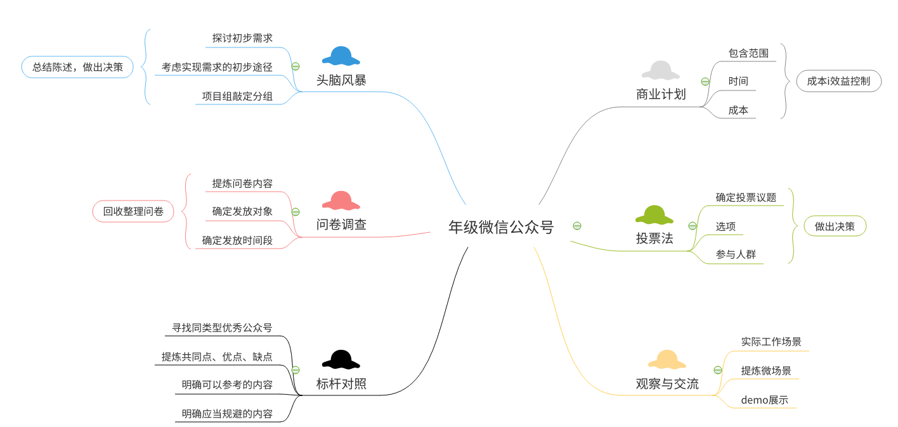

个人作业5
=========

选题1
-----

你联合同学做一个年级微信公众号加强各班相互了解、联合活动等。请写一份两页的报告，描述**收集需求的方法**，并附上收集的**需求跟踪矩阵**（不少于5个需求）。

### 收集需求的方法

#### 1 数据收集

- 头脑风暴：召集有志于加入项目企划和开发运营的同学，组成小组后群体讨论，开放性地收集项目或产品需求；
- 问卷调查：针对头脑风暴中想到的有待商榷的地方或者创新想法，设计问卷星发放调查并回收结果；
- 标杆对照：查找类似的本校或其他院校的优秀年级微信公众号，对比产品及运营开发过程；

#### 2 文件分析

- 商业计划：我们的项目本质上并不是商业性质的项目，但是也要类似地进行范围、时间、成本等分析，以便推进项目开发进程；

#### 3 决策

- 投票法：鉴于我们的年级微信公众号的受众是广大师生，所以按多数人的意愿决定项目范围和产品需求会是比较合理的做法；

#### 4 社交与团队技能

- 观察与交流：整个微信号承担的任务是加强个半相互了解、联合活动，本质上是和实际师生生活息息相关的各种微场景，小组会议时最好利用实际工作场景或demo演示发掘需求；

### 需求跟踪矩阵

| 标识 | 关联标识 |     需求描述     |                  业务需要、机会、目的和目标                  |        项目目标        |  WBS可交付成果   |                 产品设计                 | 产品开发           |                           测试案例                           |
| :--: | :------: | :--------------: | :----------------------------------------------------------: | :--------------------: | :--------------: | :--------------------------------------: | ------------------ | :----------------------------------------------------------: |
|  1   |   1.0    |    各班班级群    |         为班级同学提供内部交流、商议、统计事务的平台         |   创建班级内部微信群   |  班级内部微信群  |            借助班级通讯录完成            | -                  |              用测试小组涉及的班级通讯录作为案例              |
|      |   1.1    |    年级交流群    |            为年级同学提供年级范围内事务交流的平台            |      创建年级qq群      |     年级qq群     |              借助年级通讯录              | -                  |                 测试阶段用班级通讯录模拟即可                 |
|      |   1.2    | 班级负责人交流群 | 各班班长、团支书需要相互讨论、交流班级具体活动的举办、 联合、报表上交 |  创建班级负责人微信群  | 班级负责人微信群 |          收集各班负责人通讯方式          | -                  |                              -                               |
|  2   |   2.0    |   活动交流日报   |                用于展示年级内每日新放送的活动                | 每日上传更新活动展示表 |    活动展示表    |        参考“亿图”等产品设计日报表        | 借助微信小程序实现 |        在设计小组成员中进行，检查日报表更新是否有异常        |
|      |   2.1    |      投票版      |         对于需要投票商议、做调查的内容，设置专门板块         |  每日上传更新投票链接  |     投票链接     |          列表展示正在进行的投票          | 借助公众号推文实现 |             测试小组模拟投票，后台查看是否有异常             |
|      |   2.2    |   联合活动周报   |            每周对年级活动做一次周报，便利师生使用            |  每周整合更新活动周报  |   活动展示周表   | 形式参考日报表，但实现的是一周的汇总整合 | 借助微信小程序实现 | 测试流程中，模拟经过一周的活动推送，查看周报表的整合是否异常 |

选题3
-----

使用思维导图，为作业1或2构建WBS，并使用项目管理工具制作WBS或甘特图。并按要求检查工作包的可管理性、分解完整性。例如：检查测试、培训等。

### 思维导图

### WBS

检查可知，分配粒度遵循：可以分配、可以交付。能够实现管理项目进度和成本控制的基础（可管理性），每一层子任务也100%覆盖它的上一层任务，可见分解完整，符合要求。

